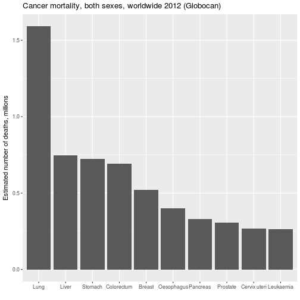
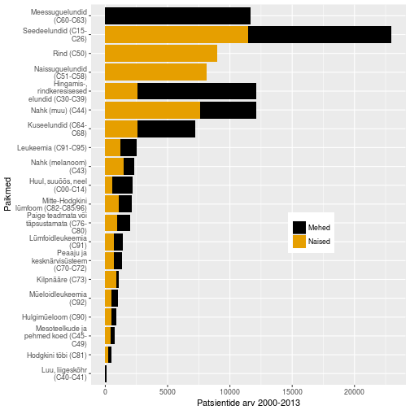

## Vähk võib lõppeda surmaga

- Vähkkasvajad on maailmas üks juhtivatest surma põhjustatavatest haigustest, nõudes 8.2 miljonit elu 2012. a (EU-27 osakaal 2012: 1.27 miljonit (15%))
- Kopsu-, maksa-, mao-, kolorektaal- ja rinnakasvajad põhjustavad enim 
vähisurmasid
- sagedasemad vähitüübid on naistel ja meestel erinevad
- ennustatakse, et haigestumus suureneb maailmas 14 miljonilt 2012.a 22 miljonini 2030-ndatel

<footer class="source">Allikas: WHO
</footer>

---

<footer class="source">Andmed: [Cancer today](http://gco.iarc.fr/today/online-analysis-multi-bars?mode=cancer&mode_population=continents&population=900&sex=0&cancer=24&type=1&statistic=0&prevalence=0&color_palette=default)</footer>

---
## Kursuse eesmärk

- **Selgitada vähkkasvajate tekke molekulaarseid ja rakulisi mehhanisme**

---&twocol

## Raamat

***=left

- Robert A. Weinberg    
<b>The Biology of Cancer</b>  
New York, Garland Science, 2007   
Kohaviit: 616/W-46

***=right

--- .segue .dark .nobackground

## Ajaloost

---&twocol

## Egiptus, 16-17. dünastia

***=left

- Vanim teadaolev kirjeldus vähist pärineb 1500 BC Egiptusest. 
- Papüürus kirjeldab muuseas ka 8 rinnavähi juhtu mida raviti põletusega. 
- Kirjutises konstanteeritakse et see haigus on ravimatu.

***=right

<footer class="source">Allikas: Wikipedia. Pilt: "Edwin Smith Papyrus v2" by Jeff Dahl
</footer>

---
## Kasvajad kui tulnukad

- Hippokrates: vähi "kehavedelike tasakaalu häire teooria" (must-, kollane sapp, veri ja flegma) 
- vähke ajalooliselt käsitletud ka kui võõrkeha, mis on ennast haige kehas sisse seadnud.

    

<footer class="source">Pilt: Vähi kirurgiline eemaldamine, 1689. Wikimedia.
</footer>

---&twocol
## Kasvajad on koelise struktuuriga

***=left
- 1655. avastas Robert Hooke mikroskoopi kasutades, et taimekude koosneb rakkudest. 
- Seoses mikroskoopia arenguga 19. saj. saadi aru, 
    - kasvajad koosnevad rakkudest 
    - pärinevad normaalsetest kudedest

***=right

    

<!--  -->

<footer class="source">Pilt: internet.
</footer>

---&twocol
## Vähki põhjustavad kartsinogeenid

***=left

- 1775. a. identifitseeris kirurg sir Percivall Pott korstnapühkijatel nõe ja munandikasvajate vahelise seose - keskkonnas leiduvad kartsinogeenid võivad põhjustada vähki.

***=right

<footer class="source">Pilt: Korstnapühkijad, hilised 1800-ndad. Wikimedia.
</footer>

--- .segue .dark .nobackground

## Tänapäev

---
## Vähiriski mõjutab elustiil

~30% vähisurmadest on tingitud viiest käitumis ja dieediriskist: 
- kõrge kehamassiindeks, 
- vähe puu- ja aedvilju menüüs, 
- vähene füüsiline aktiivsus, 
- tubakas/suitsetamine, 
- alkohol

- arengumaades põhjustavad 20% vähkidest hepatiidi viirused B ja C ning papilloomiviirused

---
## Ülekaalulisus ja vähk

- Ülekaalulisus ja rasvumine on maailmas kasvav probleem.
- Ülekaalulisus ja rasvumine suurendab vähiriski mitmete vähitüüpide puhul: rinna-, soole-, neeru-, endomeetriumi-, söögitoru- ja pankrease vähk. 
- Vähiteraapias on ülekaalulisus ja rasvumine seotud suurenenud vähi tagasituleku ja surma riskiga. 
- **Füüsiline aktiivsus ja tervislik toit** vähendavad riski oluliselt.

<footer class="source">Allikas: 
<a href="http://www.cancer.org/research/acsresearchupdates/more/three-top-cancer-challenges-of-the-21st-century?utm_source=MB_Twit&utm_medium=Social&utm_content=Feb03_A&utm_campaign=Feb_2015"> www.cancer.org.
</a>
</footer>

---
## Kuidas siis ülekaalulisus on vähiga seotud?

- Immuunsüsteemi tervis/funktsioneerimine, põletik.
- Teatud hormoonide tase organismis, nagu insulin ja östrogeen.
- Rakkude jagunemist reguleerivad kasvufaktorid -- _insulin-like growth factor-1_ (IGF-1).
- Valgud mis mõjutavad hormoonide toimet organismile, nagu _sex hormone-binding globulin_.

---
## Kasvajarisk on seotud elustiiliga

**Suitsetamine: 96% kopsuvähkidest tekib suitsetajatel**

Sigarette päevas enne haigestumist | Suheline risk 
-----------------------------------|---------------
mittesuitsetaja | 1
1 kuni 5 | 8
5 kuni 15 | 12
15 kuni 25 | 14
25+ | 27

---&twocol
## Suitsetamise tõus arengumaades

***=left

- Üle 1.3 miljardi inimese suitsetab maailmas tubakat. Suitsetamine põhjustab erinevaid kasvajaid ja vastutab 1/5 vähisurmade eest maailmas.
- Lähis-Idas ja Aafrikas on ajavahemikus 1990-2009 sigarettide tarbimine suurenenud 57%.
- Kuigi keskeas suitsetamise maha jätmine vähendab üle 60% kopsuvähi riski, teevad arengumaades seda vähesed.
- Sigarettide maksustamises nähakse vastumeedet, kuid sissetulekud tõusevad kiiremini kui maksud.

***=right

<footer class="source">Allikas: 
<a href="http://www.cancer.org/research/acsresearchupdates/more/three-top-cancer-challenges-of-the-21st-century?utm_source=MB_Twit&utm_medium=Social&utm_content=Feb03_A&utm_campaign=Feb_2015"> www.cancer.org.
</a>
</footer>

---
## Keskkonna ja elustiilifaktorid

Type | % of total cases
-----|-----------------
**Cancers due to occupational exposures** | 1–2
**Lifestyle cancers** | 
Tobacco-related (sites: e.g., lung, bladder, kidney) | 34
Diet (low in vegetables, high in nitrates, salt) (sites: e.g., stomach, esophagus) | 5
Diet (high fat, lower fiber, broiled/fried foods) (sites: e.g., bowel, pancreas, prostate, breast) | 37
Tobacco and alcohol (sites: mouth, throat) | 2

---
## Kartsinogeenina toimivad nii füüsilised kui keemised mutageenid

- **röntgenkiired**
- **benseen** (ägedad leukeemiad)
- **vinüülkloriid** (maksa angiosarkoom)
- **raadium**(osteosarkoom)
- **asbest** (mesotelioom)
- **põsetubakas** (suuõõne kartsinoom)
- etc. etc

---
##  Mutageesuse test: Amesi test

**Mutageensus korreleerub kantserogeensusega! Kuid kõik kantserogeenid ei ole mutageenid, selliseid nimetatake kasvaja promootoriteks** 

- Uuritav aine aktiveeritakse metabooselt kasutades roti maksa ekstrakti
- aktiveeritud aine lisatakse his-mutantsetele *Salmonella* tassidele
- algne *Salmonella* mutant ei suuda kasvada söömel milles puudub histidiin 
- katse lõpus loetakse kolooniad üle
- mida rohkem kolooniad seda tugevam mutageen

---
## Bruce Ames's carcinogens identified in the normal diet

Foodstuff | Compound | Concentration in foodstuff
-----------|---------|----------------------------
Black pepper | piperine | 100 mg/g
Common mushroom | agaritine| 3 mg/g
Celery | furocoumarins, psoralens | 1 mg/g, 0.8 mg/g
Rhubarb| anthraquinones | varies
Cocoa powder | theobromine | 20 mg/g
Mustard, horseradish | allyl isothiocyanate | varies
Alfalfa sprouts | canavaninec | 15 mg/g
Burnt materialsd | large number | varies
Coffee | caffeic acid  | 11.6 mg/g

---
## Kasvajatesse haigestumus Eestis

<footer class='source'>
Andmed: [Vähiregister, TAI](http://www.tai.ee/et/tegevused/registrid/vahiregister)
</footer>

---
## Kasvajad Eestis paikmete kaupa

<footer class='source'>
Andmed: [Vähiregister, TAI](http://www.tai.ee/et/tegevused/registrid/vahiregister)
</footer>

---
## Sagedasemad paikmed

<footer class='source'>
Andmed: [Vähiregister, TAI](http://www.tai.ee/et/tegevused/registrid/vahiregister)
</footer>

---
## Esmased vähid ja 5 aasta suremus
# Sõltuvalt vähitüübist võib elulemus varieeruda 10% kuni 90% 

    

<footer class="source">
Pilt: E. Marshall. “Cancer Research and the \$90 Billion Metaphor”. In: _Science_ 331.6024 (2011), pp. 1540 - 1541. DOI: 10.1126/science.331.6024.1540-a
</footer>

---
## Countries showing highest and lowest incidence of specific types of cancer

Cancer site | Country of highest risk| Country of lowest risk | Relative risk H/L
------------|------------------------|------------------------|-------------------
Melanoma | Australia (Queensland) | Japan | 155
Lip | Canada (Newfoundland) | Japan | 151
Nasopharynx | Hong Kong | United Kingdom | 100
Prostate | U.S. (African American)| China |70
Liver |China (Shanghai) | Canada (Nova Scotia) | 49
Penis |Brazil | Israel (Ashkenazic) | 42
Cervix (uterus) | Brazil Israel (non-Jews) | 28
Stomach| Japan | Kuwait | 22
Lung | U.S. (Louisiana, African American) | India (Madras) | 19
Pancreas | U.S. (Los Angeles, Korean American)| India | 11
Ovary | New Zealand (Polynesian) | Kuwait | 8

--- .segue .dark .nobackground

## Vähitüübid

---
## Kliiniline klassifikatsioon

Kliiniliselt võib kasvajad jaotada kaheks
- healoomulised (lokaliseerunud, mitteinvasiivsed)
- pahaloomulised (invasiivsed, metastaatilised)

Metastaasid ehk vähi siirded vastutavad lõviosa kasvajatest tingitud surmade eest!

<!-- - TNM-klassifikatsioon -->

<footer class="source">Pilt: doctorsgates.blogspot.com
</footer>

---
## Neli põhilist vähitüüpi

Epiteliaalsed              | Mitte-epiteliaalsed
---------------------------|--------------------
kartsinoomid (*carcinoma*) | sarkoomid (*sarcoma*)
                           | hematopoieetilised
                           | neuroektodermaaltuumorid

---&twocol
## Epiteel

Kehaosi väljast ja õõsi seest kattev rakukiht (katteepiteel) või näärmeid moodustav rakukogum (näärmeepiteel).

***=left

***=right

<footer class="source">Pildid: Left, by LWozniak&KWZielinski (Own work) [CC BY-SA 3.0](http://creativecommons.org/licenses/by-sa/3.0) or [GFDL](http://www.gnu.org/copyleft/fdl.html)], via Wikimedia Commons</footer>

---&twocol
## Basaalmembraan

***=left

<footer class="source">[Pilt: Robert Trelstad](http://www.britannica.com/EBchecked/media/37634/Scanning-electron-micrograph-of-basal-lamina-in-the-cornea-of)</footer>

***=right

BM (basement membrane) on epiteeli all asuv rakuvälise maatriksi kiht
 - peamiseks funktsiooniks on epiteeli ankurdamine all olevale sidekoele (strooma)
 - mehhaaniline barjäär

---
## Kartsinoomid 

Kartsinoomid on kõige sagedasemad epiteliaalset päritolu kasvajad 

- vastutavad 80% vähisurmade eest

---
## Epiteelid pärinevad erinevatest lootelehtedest

- kops, maks, sapipõis, söögitoru, magu ja soolestik pärineb **endodermist** 
- nahk **ektodermist**
- munasarjad **mesodermist**

---
## Kartsinoomid jagunevad laias laastus kaheks

- **adenokartsinoomid** (*adenocarcinoma*)
- **lamerakk-kartsinoomid** (*squamous-cell carcinoma*)

---
## Kartsinoomide sagedasemad paikmed

**Adeno** | **Lame-rakk**  | **Muud tüüpi** 
------------------|------------------------|------------------------
kops|nahk|väikeserakuline kopsuvähk (neuroendokriinsed rakud)
käärsool (*colon*)|ninaõõs|suurerakuline kopsuvähk
rind|neel (*oropharynx*)|maksakartsinoom
kõhunääre (*pancreas*)|kõri|neerukasvaja
magu|kops|transitoorse epiteeli kasvaja (kusepõis)
söögitoru|söögitoru| 
eesnääre|emakakael| 
emaka sisemine limaskest (endomeetrium)| | 
munasari| | 

---
## Mitte-epiteliaalsed kasvajad

- **sarkoomid** - sidekoekasvajad 
- hematopieetilist päritolu kasvajad (valged verelibled)
    - **leukeemiad** - nn. verevähk
    - **lümfoomid** - tahked kasvajad lümfisõlmedes (B- ja T-rakud)
- **neuroektodermaaltuumorid**

---&twocol
## Sarkoomid

***=left

- sidekoe kasvajad
- moodustavad ~1% vähkidest
- mesodermaalset päritolu

***=right

Sagedasemad sarkoomid|
-------------------|
**osteo**sarkoom|
**lipo**sarkoom|
**leiomüo**sarkoom|
**rhabdomüo**sarkoom|
**fibro**sarkoom|
**sünooviumi** sarkoom|
**angio**sarkoom|
**kondro**sarkoom|

---
## Hematopoieetilised ja lümfoidsed kasvajad

Tuumorid mis tekivad **veres, luuüdis ja lümfisõlmedes**

# Rakutüübid:
- Äge ja krooniline müelogeenne leukeemia, müelodüsplastilised sündroomid ja müeloproliferatiivsed haigused: granulotsüüdid, erütrotsüüdid, trombotsüüdid, makrofaagid ja nuumrakud (*mast cells*)

- Lümfoomid, lümfotsüütsed leukeemiad ja müeloomid: B-, T-, NK- ja plasma rakud
  - äge lümfotsüütne leukeemia (**ALL**) tekib 80% juhtudel B-rakkudest ja 20% T-rakkudest

---&twocol
## Sagedasemad hematopoieetilised kasvajad

***=left
          |
---------------|
äge lümfotsüütne leukeemia (**ALL**)|
äge müelogeenne leukeemia (**AML**)|
krooniline müelogeenne leukeemia (**CML**)|
krooniline lümfotsüütne leukeemia (**CLL**)|
multimüeloom (**MM**)|
non-Hodgkin's lümfoom (**NHL**)|
Hodgkin's tõbi|

***=right

<footer class="source">[Pilt: pathologystudent.com](http://www.pathologystudent.com)</footer>

---
## Neuroektodermaalsed kasvajad

- Vähid mis tekivad **kesknärvisüsteemis ja perifeerses närvisüsteemis**
- **ektodermaalset** päritolu
- glioomid, glioblastoomid, neuroblastoomid, shwannoomid/oligodendroglioomid ja medulloblastoomid
- moodustavad 1.3% diagnoositud kasvajatest, suremus samas kõrge 2.5% vähisurmadest

---&twocol
# CNS/PNS kasvajad

***=left
- glioblastoomid **GBM** ja astrotsütoomid: astrotsüüdid
    - GBM, agressiivne IV staadiumi astrotsütoom
- shwannoomid/oligodendroglioomid pärinevad müeliini moodustavatest rakkudest
- retinoblastoom
- neuroblastoomid pärinevad PNSi ganglionitest 

***=right

<footer class="source">Pilt:[wikimedia](http://en.wikipedia.org/wiki/Glioblastoma_multiforme)</footer>

---
## Vähid mis ei klassifitseeru eelnimetatud gruppidesse

- **melanoom** - nahakasvaja, neuroektodermaalset päritolu: naha melanotsüüdid pärinevad neuraalharjast
- **väikeserakulised kopsukasvajad** (*SCLC*) - sarnased neurosekretoorsetele rakkudele

<footer class="source">[Pilt:web.biologie.uni-bielefeld.de](http://web.biologie.uni-bielefeld.de/cellbiology/index.php/research/neural-crest-derived-stem-cells)</footer>

---
## Reeglina säilitavad vähid oma päritolu-koe tunnused

Olulise ühendva bioloogilise printsiibina säilitavad vähirakud alati mõne distinktse diferentseerunud tunnuse mis seob neid oma päritolukoega

<footer class="source">Pilt: tsütokeratiin-positiivne mikrometastaas. www.breastpathology.info</footer>

---
## Epiteeli-mesenhümaalne transformatsioon

 **EMT** on raku transdifferentseerumine, kus algne **kartsinoomi rakk omandab mesenhümaalse fenotüübi**
 - EMT on seotud metastaseerumisega
 - NB! EMT ei ole kartsinoomis histoloogiliselt jälgitav
 - tegemist võib olla transientse seisundiga

<footer class="source">Pilt: http://www.sabiosciences.com/</footer>

---
## Anaplastilised kasvajad

**Anaplaasia** - kasvaja mis on kaotanud koespetsiifilised tunnused (1-2% juhtudest)
 - **histopatoloogliselt pole võimalik identifitseerda päritolu-kude**
 - võib tekkida dediferentseerumise teel
 - võib pärineda tüvirakkudest
 - **pleomorfism**, rakud ja tuumad on ebaühtlase suuruse-kujuga
 

---&twocol
## Molekulaarne klassifikatsioon

***=left

- osad kasvajad koespetsiifilised, teised mitte:
- kopsu lamerakk, pea-kaela ja osa põiekasvajaid moodustavad ühe alatüübi
- põievähid lahknevad eri alatüüpidesse.

***=right

<footer class="source">[Multiplatform Analysis of 12 Cancer Types Reveals Molecular Classification within and across Tissues of Origin](http://www.sciencedirect.com/science/article/pii/S0092867414008769)</footer>

---&twocol
## Vähid arenevad progresseeruvalt

***=left

Vähi staadiume iseloomustab järk-järguline progresseerumine healoomulisest kasvajast kuni metastaasideni

***=right

<footer class="source">[Pilt:hopkinscoloncancercenter.org](http://www.hopkinscoloncancercenter.org/CMS/CMS_Page.aspx?CurrentUDV=59&CMS_Page_ID=0B34E9BE-5DE6-4CB4-B387-4158CC924084)</footer>

---
## Kasvaja kliiniline progressioon

**Neoplaasiad** - eri tüüpi kasvajalised moodustised

Rohkem-vähem defineeritud "peatused" kasvaja arengus:

Normaalne kude > hüper-/metaplastiline > düsplaasia > lokaalselt invasiivne > metastaasid

---
## Healoomulised kasvajad

Healoomulised (*benign*) kasvajad võivad olla **hüperplastilised** või **metaplastilised** (*hyperplastic*, *metaplastic*)
- hüperplastiline kude näeb välja normaalsena, välja arvatud märgatavalt suurenenud rakkude arv
- metaplastilises koes on üks normaalne kude asendunud teisega nt. Barreti söögitoru

---&twocol
## Düsplaasia

***=left

***=right

**Düsplaasiad** sisaldavad juba rakke mis näevad välja ebanormaalsed.
- healoomulised kuid pre-maliigne seisund (basaalmembraan on terve!)
- adenoomid, polüübid, papilloomid, soolatüükad

---&twocol
## Pahaloomulised kasvajad 

***=left

 iseloomustab invasiivsus st. vähirakud on tunginud läbi **basaalmembraani**

- lokaalselt invasiivne
- siirded

***=right

---
## Metastaasid e. siirded

Kasvajakolooniate teke keha teistesse osadesse/organitesse
- lisaks invasiivsusele peab vähirakk omandama ka **amööbse liikumise võime** (*motility*)
- ja **võime adapteeruda** "võõras keskkonnas"

---
## Kasvajad on monoklonaalsed
Teoreetiliselt võivad kasvajat moodustavad vähirakud  olla kas **monoklonaalset** või **polüklonaalset** päritolu

- Epigeneetika viitab monoklonaalsele päritolule: X-kromosoomi inaktivatsioon on rakkudes juhuslik, 30% Aafrika päritolu naistel on polümorfsm G6PD geenis (asub X-is), leiomüoomi heterosügootsete patsientidel leiti, et igal leiomüoomil esines ainult ühte geeni versiooni
- müeloomid, müeloomid pärinevad B-rakkude eellastest, antikehi tootvatest plasmarakkudest, iga antikeha toodab üks kloon, igal patsiendil toodab müeloom vaid ühte antikeha

--- .segue .dark .nobackground

## Lingid teistele loengutele

--- &twocol 

***=left 

- [Sissejuhatav loeng:vähk, haigestumus ja vähitüübid](http://tpall.github.io/onkobioloogia)
- [Viirused ja onkogeenid](http://tpall.github.io/viirused-ja-onkogeenid)
- [Retseptorid](http://tpall.github.io/Retseptorid)
- [Signaalirajad](http://tpall.github.io/Signaalirajad)
- [Tuumorsupressorgeenid](http://tpall.github.io/Tuumorsupressorid)
- [Rakutsüklikontroll](http://tpall.github.io/Rakutsyklikontroll)

***=right 

- [p53 ja apoptoos](http://tpall.github.io/p53-ja-apoptoos)
- [Immortalisatsioon](http://tpall.github.io/Immortalisatsioon)
- [Tumorigenees](http://tpall.github.io/Tumorigenees)
- [Genoomiterviklikkus](http://tpall.github.io/Genoomiterviklikkus)
- [Mikrokeskkond ja metastaas](http://tpall.github.io/Mikrokeskkond-ja-metastaas)
- [Immuunsus](http://tpall.github.io/Immuunsus)
- [Vähiravimid](http://tpall.github.io/Vahiravim)
